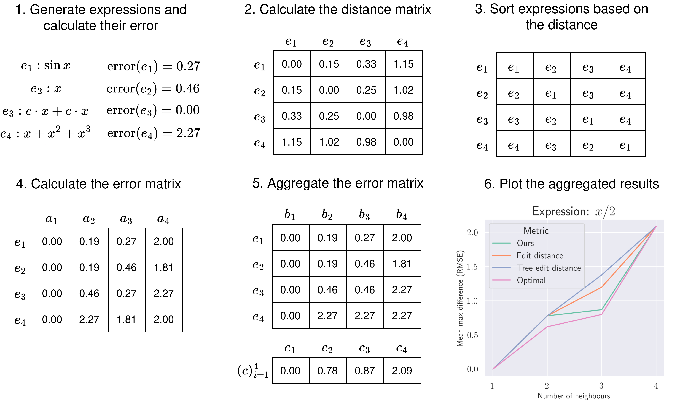

# Behaviour-Aware Expression Distance (BED) 

This repository implements the distance metric from the paper **_Quantifying Behavioural Distance Between Mathematical Expressions_**.
Additionally, this repository contains reproducible experiments from the paper.


## Quickstart Instructions
1. Install rust (instructions at [https://www.rust-lang.org/tools/install](https://www.rust-lang.org/tools/install))
2. Create a new (conda) environment
3. Install dependencies with the command: `pip install -r requirements.txt`
4. Use the BED class as in the example below

```
from bed import BED

expressions = [["2", "*", "A", "*", "B"], ["C", "*", "B", "-", "A"]]
bed = BED(expressions, [(1, 5), (1, 5)], (0.2, 5), infix=True, seed=0)
print(bed.calculate_distances())
```
The example above can be found in the BED/example.py script.


## Hyperparameter explanation

BED uses the following hyperparameters and their default values:

| Parameter        | Description                                                                                                                                                                 | Type                 | Default Value |
|------------------|-----------------------------------------------------------------------------------------------------------------------------------------------------------------------------|----------------------|---------------|
| expressions      | Expressions between which you want to calculate the distance                                                                                                                | list[list[str]]      |               |
| x_bounds         | Lower and upper bounds for each variable that occurs in the expressions (Each variable can have a different domain)                                                         | list[(float, float)] |               |
| const_bounds     | Lower and upper bounds for constant values that will be sampled during the computation of the distance                                                                      | (float, float)       | (0.2, 5)      |
| points_sampled   | Number of variable values sampled during the computation of the distance                                                                                                    | int                  | 64            |
| consts_sampled   | Number of constant values sampled during the computation of the distance                                                                                                    | int                  | 16            |
| expressions2     | If not None, the distance between expressions and expressions2 is computed instead of the distances between each pair of expressions in the expressions parameter           | list[list[str]]      | None          |
| x                | Points on which the distance will be computed. If None, points are sampled instead.                                                                                         | numpy.array          | None          |
| randomized       | If True, new points and constants are sampled for each calculation of the distance (computationally expensive). If parameter x is not None, this parameter will be ignored. | bool                 | False         |
| infix            | By default, the input expressions should be in the postfix notation. If you input expressions in the infix notation, this parameter must be set to True                     | bool                 | False         |
| cutoff_threshold | Threshold for the maximum value an expression can evaluate to. Evaluations with the maximum absolute value higher than this threshold will be ignored                       | float                | 1e20          |
| default_distance | Distance between two expressions at a point where one expression produces valid evaluations and another invalid ones. Example point -1 for expressions $x$ and $\sqrt{x}$   | float                | 1e10          |
| seed             | Random seed for reproducible results                                                                                                                                        | int                  | None          |

## Smoothness of the error landscape
You can evaluate the smoothness of the error landscape using BED/error_landscape_smoothness.py. An overview of the approach for calculating this smoothness can be seen in the image below.
