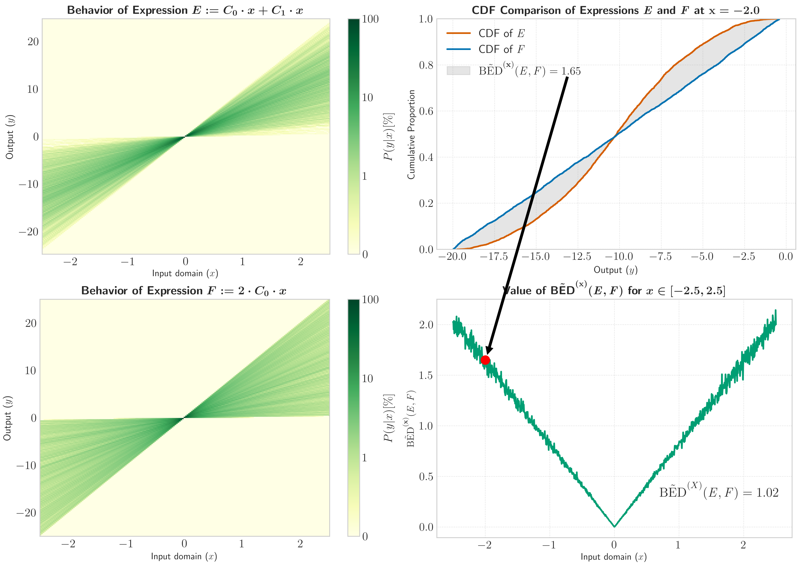

# Behaviour-Aware Expression Distance (BED) 

This repository implements the distance metric from the paper **_Quantifying Behavioural Distance Between Mathematical Expressions_**.
Additionally, this repository contains reproducible experiments from the paper.


## Quickstart Instructions
1. Create a new (conda) environment
2. Install dependencies with the command: `pip install git+https://github.com/smeznar/BED`
3. Use the BED class as in the example below

```
from bed import BED

expressions = [["2", "*", "A", "*", "B"], ["C", "*", "B", "-", "A"]]
bed = BED(expressions, [(1, 5), (1, 5)], (0.2, 5), seed=0)
print(bed.calculate_distances())
```


expressions, x_bounds=None, const_bounds=(0.2, 5), points_sampled=64, consts_sampled=32, expressions2=None,
                 x=None, randomized=False, cutoff_threshold=1e20, default_distance=np.inf, symbol_library=None, seed=None)

## Hyperparameter explanation

BED uses the following hyperparameters and their default values:

| Parameter        | Description                                                                                                                                                                 | Type                          | Default Value |
|------------------|-----------------------------------------------------------------------------------------------------------------------------------------------------------------------------|-------------------------------|---------------|
| expressions      | Expressions between which you want to calculate the distance                                                                                                                | list[list[str]]               |               |
| x_bounds         | Lower and upper bounds for each variable that occurs in the expressions (Each variable can have a different domain)                                                         | list[(float, float)]          |               |
| const_bounds     | Lower and upper bounds for constant values that will be sampled during the computation of the distance                                                                      | (float, float)                | (0.2, 5)      |
| points_sampled   | Number of variable values sampled during the computation of the distance                                                                                                    | int                           | 64            |
| consts_sampled   | Number of constant values sampled during the computation of the distance                                                                                                    | int                           | 16            |
| expressions2     | If not None, the distance between expressions and expressions2 is computed instead of the distances between each pair of expressions in the expressions parameter           | list[list[str]]               | None          |
| x                | Points on which the distance will be computed. If None, points are sampled instead.                                                                                         | numpy.array                   | None          |
| randomized       | If True, new points and constants are sampled for each calculation of the distance (computationally expensive). If parameter x is not None, this parameter will be ignored. | bool                          | False         |
| cutoff_threshold | Threshold for the maximum value an expression can evaluate to. Evaluations with the maximum absolute value higher than this threshold will be ignored                       | float                         | 1e20          |
| default_distance | Distance between two expressions at a point where one expression produces valid evaluations and another invalid ones. Example point -1 for expressions $x$ and $\sqrt{x}$   | float                         | 1e10          |
| symbol_library   | Library of symbols (SRToolkit.utils.SymbolLibrary) that make us the expressions                                                                                             | SRToolkit.utils.SymbolLibrary | None          |
| seed             | Random seed for reproducible results                                                                                                                                        | int                           | None          |

## Overview of the approach
An overview of the approach is shown below. First, we sample points in the given domain and tuples of free parameters values, which we use 
to evaluate a given expression and create a description of its behavior (e.g. a matrix with values calculated at these points and parameter values).
We then use these matrices to calculate the Wasserstein distance between two expressions at each point. The final distance is calculated as
the mean of these distances at each point. The image below shows an example of how the distance is calculated for two expressions.

